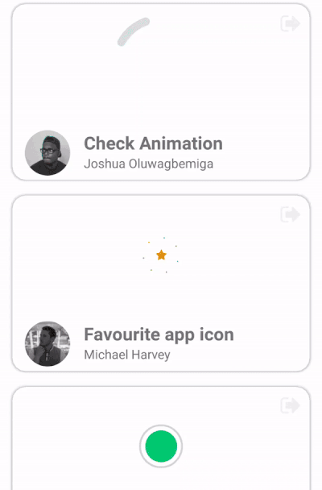

# react-native-lottie-files-picker
A React Native List that supports the selection of beautiful Lottie Animations sourced by Lottie Files.

<p align="center">
  
</p>

## 🚀 Installing
Using [`npm`](https://www.npmjs.com/package/@cawfree/react-native-lottie-files-picker):

```
npm install --save @cawfree/react-native-lottie-files-picker
```

Using [`yarn`](https://www.npmjs.com/package/@cawfree/react-native-lottie-files-picker):

```
yarn add @cawfree/react-native-lottie-files-picker
```

## 👍 About
We have file browsers, camera roll viewers and emoji pickers. Why not let your users jazz up their content using Lottie Files, too? Animations are presented to the user via an [`<InfiniteList/>`](https://github.com/foundcareers/react-native-infinite-flatlist), from which the user can pick to browser from one of the `recent`, `popular` or `featured` animations using [`crawl-lottie-files`](https://www.npmjs.com/package/crawl-lottie-files).

## ✍️ Example

```javascript
import React from 'react';
import { Alert } from 'react-native';
import LottieFilesPicker from '@cawfree/react-native-lottie-files-picker'

class AnimationScreen extends React.Component {
  render() {
    return (
      <LottieFilesPicker
        onSelect={({ path }) => {
          Alert.alert(`Looks like you picked ${path}. Nice choice.`);
        }}
      />
    );
  }
}

export default AnimationScreen;
```

Yup.

## Special Thanks
Huge thank you to [reallynattu](https://github.com/reallynattu) and the team at [LottieFiles](https://lottiefiles.com) for being super cool with open-source stuff. All credit for the embedded artwork and animation hosting goes utterly to them.

## License
[MIT](https://opensource.org/licenses/MIT)
